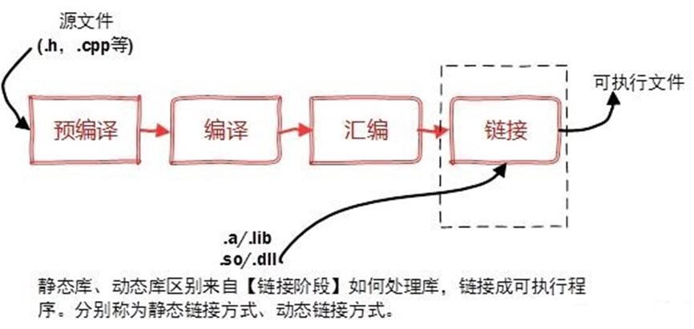

# 什么是库
## GCC编译过程
库是写好的现有的，成熟的，可以复用的代码。现实中每个程序都要依赖很多基础的底层库，不可能每个人的代码都从零开始，因此库的存在意义非同寻常。
库从本质上来说是一种可执行代码的二进制格式，可以被载入内存中执行。
库有两种：静态库（.a、.lib）和动态库（.so、.dll）。
所谓静态、动态是指链接。回顾一下，将一个程序编译成可执行程序的步骤：

## 预处理（Preprocessing）
这个阶段处理源代码中的 预处理指令（以 `#` 开头的指令）。
**主要工作：**
1. **展开头文件**：将 `#include` 指令替换为对应头文件的实际内容。
2. **宏替换**：展开所有 `#define` 定义的宏。
3. **条件编译**：根据 `#if`, `#ifdef`, `#ifndef`, `#else`, `#elif`, `#endif` 等指令，决定哪些代码块参与编译。
4. **删除注释**：移除所有 `//` 和 `/* ... */` 注释。
5. **添加行号和文件名标识**：为调试器和编译器后续阶段提供信息。

**查看预处理结果：**
```bash
gcc -E hello.c -o hello.i
# 或
cpp hello.c > hello.i  # cpp 是 C Preprocessor
```
查看 hello.i 文件，你会发现它比原始的 hello.c 大很多，因为头文件内容都被直接插入进来了。
**常见应用场景：**
- 调试宏定义是否正确展开。
- 确认头文件包含内容。
## 编译（Compilation，狭义）
这个阶段将预处理后的 **高级语言代码（.i 文件）** 翻译成特定 CPU 架构的 **汇编语言代码（.s 文件）**。
**主要工作：**
1. **词法分析**：将字符序列分割成有意义的 **记号（Token）**，如关键字、标识符、常量、运算符。
2. **语法分析**：根据语法规则，将 Token 组合成 **抽象语法树（AST）**。
3. **语义分析**：检查 AST 是否符合语言规范（如类型检查、类型转换、未声明变量等）。
4. **中间代码生成与优化**：生成一种与机器无关的中间表示（如 **RTL - Register Transfer Language**），并在此进行优化（如常量传播、死代码消除）。
5. **代码生成**：将优化后的中间代码转换为目标机器的 **汇编代码**。

**查看编译生成的汇编代码：**
```bash
gcc -S hello.i -o hello.s
# 或直接从源文件开始
gcc -S hello.c -o hello.s
```
**查看 hello.s 文件，里面就是对应平台的汇编指令。例如，在 x86-64 上，你会看到 `mov`, `call`, `push`, `pop` 等指令。**
**注意**：`-S` 选项只进行到编译阶段就停止。
## 汇编（Assembly）
这个阶段将可读的 **汇编代码（.s 文件）** 翻译成机器可以执行的 **二进制指令（目标文件 .o 文件）**。
**主要工作：**
1. 将每条汇编指令 **一对一** 地转换成对应的机器码。
2. **生成目标文件**，这是一种 **可重定位目标文件**，包含了机器指令、数据以及链接阶段所需的信息（如符号表）。

**使用 GCC 进行汇编：**
```bash
gcc -c hello.s -o hello.o
# 或直接从源文件开始
gcc -c hello.c -o hello.o
```
**生成的 `hello.o` 是二进制文件，无法直接用文本编辑器查看。**

**重要概念：可重定位目标文件**
- 此时函数（如 `printf`）的地址尚未确定，只是一个临时占位符（通常是 0）。
- 变量如果被声明为 `extern`，其地址也未确定。
- 文件内定义的函数和全局变量，其相对于文件开头的偏移量是确定的。
## 链接（Linking）
这是最后一步，也是最复杂的一步。它将一个或多个 **.o 目标文件** 和 **库文件** 合并，生成一个可以加载到内存并执行的 **可执行文件**。
**主要工作：**
1. **符号解析**：将每个 **符号引用（如 `printf`）** 与一个 **符号定义** 关联起来。符号可以是函数名或全局变量名。
    - **错误示例**：`undefined reference to`xxxx'` 就是链接器在抱怨找不到符号定义。
2. **重定位**：将每个符号定义与一个内存地址关联起来，然后**修改所有引用该符号的地方**，用这个地址替换掉原来的占位符。
3. **合并目标文件**：将各个 `.o` 文件的代码段（`.text`）、数据段（`.data`、`.bss`）等，按照链接脚本合并到一起。

**使用 GCC 进行链接（默认链接 `main` 函数所在的程序）：**
``` bash
gcc hello.o -o hello
```

**链接的两种主要方式：**

| 链接类型     | 说明                              | GCC 选项                | 优点                       | 缺点                      |
| -------- | ------------------------------- | --------------------- | ------------------------ | ----------------------- |
| **静态链接** | 将库的代码**完整复制**到最终可执行文件中。         | `-static`             | 程序独立，运行时无需外部库；速度快。       | 文件体积大；库更新需重新编译程序。       |
| **动态链接** | 仅在可执行文件中记录库的名称和少量信息，**运行时**才加载。 | 默认（`-shared` 用于创建动态库） | 文件小；库可共享，节省内存；库更新无需重编程序。 | 程序依赖外部库；存在“DLL Hell”风险。 |
**检查文件类型和依赖：**
```bash
# 查看文件类型
file hello

# 查看动态链接的可执行文件依赖哪些共享库
ldd hello
```

## **GCC 常用选项详解（编译过程控制）**
| 类别       | 选项                    | 作用                               | 对应阶段      |
| -------- | --------------------- | -------------------------------- | --------- |
| **阶段控制** | `-E`                  | 只进行预处理，输出到标准输出                   | 预处理       |
|          | `-S`                  | 编译到汇编语言，生成 `.s` 文件               | 预处理、编译    |
|          | `-c`                  | 编译和汇编，但不链接，生成 `.o` 文件            | 预处理、编译、汇编 |
| （无）      | 默认，生成可执行文件 `a.out`    | 完整4阶段                            |           |
| **输出控制** | `-o <file>`           | 指定输出文件名                          | 所有阶段      |
|          | `-save-temps`         | 保留所有中间文件 (`.i`, `.s`, `.o`)      | 所有阶段      |
| **优化级别** | `-O0`                 | 不优化（默认，编译快，调试方便）                 | 编译、链接     |
|          | `-O1` / `-O2` / `-O3` | 递增的优化级别（提升运行速度，可能增加编译时间）         | 编译、链接     |
|          | `-Os`                 | 优化代码大小                           | 编译、链接     |
| **调试信息** | `-g`                  | 生成调试信息（供 GDB 使用）                 | 编译、汇编     |
| **警告信息** | `-Wall`               | 开启大部分常见警告                        | 编译        |
|          | `-Wextra`             | 启用更多警告                           | 编译        |
|          | `-Werror`             | 将警告视为错误                          | 编译        |
| **链接库**  | `-l<library>`         | 链接名为 `lib<library>.so` 或 `.a` 的库 | 链接        |
|          | `-L<dir>`             | 添加库文件搜索目录                        | 链接        |
|          | `-static`             | 强制静态链接                           | 链接        |
| **宏定义**  | `-D<macro>[=val]`     | 定义宏，等同于 `#define`                | 预处理       |
|          | `-U<macro>`           | 取消宏定义                            | 预处理       |
| **包含目录** | `-I<dir>`             | 添加头文件搜索目录                        | 预处理       |
## **编译驱动的幕后工作**
我们使用的命令都是 `gcc`。实际上，`gcc` 本身是一个 **编译驱动器**，它根据我们提供的参数，自动调用后端的各个工具来完成工作：
```bash
# 当您运行 `gcc hello.c` 时，gcc 驱动器内部大致执行了：
cpp hello.c hello.i     # 1. 预处理器 (cpp)
cc1 hello.i hello.s     # 2. 编译器 (cc1)
as hello.s hello.o      # 3. 汇编器 (as)
ld hello.o ... -o a.out # 4. 链接器 (ld) + C标准库
```
我们可以使用 `-v` 选项来查看详细的调用过程：
```bash
gcc -v hello.c -o hello
```

# 静态库（Static Library）
## 概念
静态库是在编译链接阶段将库的代码全部复制到目标程序中，因此生成的可执行文件体积较大，但运行时不再需要库文件。
## 文件后缀
在Linux下通常为`.a`（archive），在Windows下为`.lib`。
## 静态库的制作
步骤：
1. 将源文件编译成目标文件（`.o`文件）。
2. 使用`ar`工具将目标文件打包成静态库。
示例：
假设我们有以下几个文件
```c
// include/utils.h
#ifndef UTILS_H
#define UTILS_H

// 数学函数
int add(int a, int b);
int multiply(int a, int b);
double power(double base, int exp);

// 字符串函数
void reverse_string(char *str);
int count_vowels(const char *str);

// 打印函数
void print_hello(const char *name);
void print_array(int arr[], int size);

#endif
```
---
```c
// src/math_utils.c
#include "utils.h"

int add(int a, int b) {
    return a + b;
}

int multiply(int a, int b) {
    return a * b;
}

double power(double base, int exp) {
    double result = 1.0;
    for (int i = 0; i < exp; i++) {
        result *= base;
    }
    return result;
}
```
---
```c
// src/string_utils.c
#include <string.h>
#include <ctype.h>
#include "utils.h"

void reverse_string(char *str) {
    int len = strlen(str);
    for (int i = 0; i < len / 2; i++) {
        char temp = str[i];
        str[i] = str[len - i - 1];
        str[len - i - 1] = temp;
    }
}

int count_vowels(const char *str) {
    int count = 0;
    for (int i = 0; str[i]; i++) {
        char c = tolower(str[i]);
        if (c == 'a' || c == 'e' || c == 'i' || c == 'o' || c == 'u') {
            count++;
        }
    }
    return count;
}
```
---
```c
// src/print_utils.c
#include <stdio.h>
#include "utils.h"

void print_hello(const char *name) {
    printf("Hello, %s!\n", name);
}

void print_array(int arr[], int size) {
    printf("[");
    for (int i = 0; i < size; i++) {
        printf("%d", arr[i]);
        if (i < size - 1) printf(", ");
    }
    printf("]\n");
}
```
---
```c
// main.c
#include <stdio.h>
#include "utils.h"

int main() {
    // 测试数学函数
    printf("Math Functions:\n");
    printf("add(5, 3) = %d\n", add(5, 3));
    printf("multiply(4, 6) = %d\n", multiply(4, 6));
    printf("power(2, 8) = %.2f\n", power(2, 8));
    
    // 测试字符串函数
    printf("\nString Functions:\n");
    char str[] = "Hello World";
    printf("Original: %s\n", str);
    reverse_string(str);
    printf("Reversed: %s\n", str);
    printf("Vowel count: %d\n", count_vowels("Hello World"));
    
    // 测试打印函数
    printf("\nPrint Functions:\n");
    print_hello("Linux Developer");
    int arr[] = {1, 2, 3, 4, 5};
    printf("Array: ");
    print_array(arr, 5);
    
    return 0;
}
```
制作静态库：
```bash
# 1. 进入项目目录
cd myproject

# 2. 编译源代码为目标文件 (.o)
gcc -c src/math_utils.c -o obj/math_utils.o -I include
gcc -c src/string_utils.c -o obj/string_utils.o -I include
gcc -c src/print_utils.c -o obj/print_utils.o -I include

# 或者使用通配符（需要先创建obj目录）
mkdir -p obj
gcc -c src/*.c -I include
mv *.o obj/

# 3. 创建静态库（使用ar命令）
# ar命令选项：
#   r: 插入文件到归档（替换已存在的）
#   c: 创建归档（如果不存在）
#   s: 创建索引（相当于ranlib）
ar rcs libutils.a obj/*.o

# 4. 查看静态库内容
echo "=== 查看静态库包含的目标文件 ==="
ar -t libutils.a

echo -e "\n=== 查看静态库详细信息 ==="
ar -tv libutils.a

# 5. 使用静态库编译程序
gcc main.c -o main_static -I include -L. -lutils

# 选项说明：
# -I include: 指定头文件目录
# -L.: 指定库文件目录（.表示当前目录）
# -lutils: 链接libutils.a（注意：去掉"lib"前缀和".a"后缀）

# 6. 查看可执行文件大小
echo -e "\n=== 可执行文件大小 ==="
ls -lh main_static

# 7. 查看可执行文件依赖
echo -e "\n=== 查看依赖关系 ==="
ldd main_static  # 静态链接应该显示"not a dynamic executable"
```
# 动态库（Shared Library）
## 概念
动态库是在程序运行时才被加载的库，多个程序可以共享同一个动态库，因此节省内存和磁盘空间。
## 文件后缀
在Linux下通常为`.so`（shared object），在Windows下为`.dll`。
## 动态库的制作
步骤：
1. 将源文件编译成位置无关的目标文件（使用`-fPIC`选项）。
2. 使用`gcc`的`-shared`选项将目标文件打包成动态库。
示例：
假设我们有源文件与静态库笔记一样
```bash
# 1. 编译位置无关代码（Position Independent Code）
# -fPIC选项：生成位置无关代码，这是动态库必需的
gcc -c -fPIC src/math_utils.c -o obj/math_utils.o -I include
gcc -c -fPIC src/string_utils.c -o obj/string_utils.o -I include
gcc -c -fPIC src/print_utils.c -o obj/print_utils.o -I include

# 2. 创建动态库（共享对象）
# -shared选项：生成共享库
# -Wl选项：传递参数给链接器
# -soname选项：设置库的内部名称
gcc -shared -o libutils.so obj/*.o -Wl,-soname,libutils.so.1

# 3. 创建符号链接（版本管理）
ln -sf libutils.so libutils.so.1    # 主版本号
ln -sf libutils.so.1 libutils.so.1.0  # 完整版本号

# 4. 查看动态库信息
echo "=== 查看动态库信息 ==="
file libutils.so
readelf -d libutils.so | head -20

# 5. 使用动态库编译程序
gcc main.c -o main_dynamic -I include -L. -lutils

# 6. 运行程序前设置库搜索路径
# 方法1：设置LD_LIBRARY_PATH（临时）
export LD_LIBRARY_PATH=.:$LD_LIBRARY_PATH
./main_dynamic

# 方法2：复制到系统库目录（永久）
sudo cp libutils.so /usr/local/lib/
sudo ldconfig  # 更新缓存

# 7. 查看动态库依赖
echo -e "\n=== 查看动态库依赖 ==="
ldd main_dynamic
ldd libutils.so 2>/dev/null || echo "libutils.so has no dependencies"

# 8. 比较文件大小
echo -e "\n=== 文件大小比较 ==="
echo "静态链接: $(stat -c%s main_static) 字节"
echo "动态链接: $(stat -c%s main_dynamic) 字节"
```
## 动态库的加载路径问题
程序运行时，系统会在以下位置查找动态库：
1. 编译时指定的`-L`路径（但运行时不会自动搜索，除非该路径在系统默认路径中）。
2. 环境变量`LD_LIBRARY_PATH`指定的路径。（可以把export LD_LIBRARY_PATH=/tmp 语句写到 ~/.bashrc中，这样就对当前用户有效了，写到/etc/bash.bashrc中就对所有用户有效了。）
3. 系统缓存文件`/etc/ld.so.cache`中记录的路径（通过`/etc/ld.so.conf`配置）。
4. 默认的系统库路径，如`/lib`、`/usr/lib`。
## 动态库版本管理
```bash
# 1. 带版本号的动态库命名规范
# libname.so.major.minor.patch
# major: 不兼容的API变化
# minor: 向后兼容的新功能
# patch: 向后兼容的bug修复

# 2. 创建版本化动态库
gcc -shared -Wl,-soname,libutils.so.1 \
    -o libutils.so.1.0.1 \
    obj/*.o

# 3. 创建符号链接
ln -s libutils.so.1.0.1 libutils.so.1  # soname链接
ln -s libutils.so.1 libutils.so        # 开发链接

# 4. 编译时链接开发版本
gcc main.c -o main -lutils

# 5. 运行时使用具体版本
# 程序会查找libutils.so.1，然后链接到libutils.so.1.0.1
```
# 静态库和动态库优缺点
静态库：
- **优点**：
    - 程序发布时不需要依赖库文件，移植方便。
    - 加载速度快，因为库代码已经在可执行文件中。
- **缺点**：
    - 可执行文件体积大，占用磁盘和内存。
    - 库更新后需要重新编译程序。
---
动态库：
- **优点**：
    - 可执行文件体积小。
    - 库更新方便，无需重新编译程序（只要接口不变）。
    - 多个程序共享，节省内存。
- **缺点**：
    - 程序发布时需要附带库文件，或确保目标系统有该库。
    - 加载速度稍慢（因为运行时加载）。
---
# 库的使用
动态库和静态库，在链接时都是通过头文件来声明函数，然后在链接阶段解决符号引用。
但是，动态库和静态库在链接时的处理方式不同：
- 对于静态库，链接器会将库中所需的代码复制到可执行文件中，生成的可执行文件独立运行。
- 对于动态库，链接器不会将库代码复制到可执行文件中，而是在可执行文件中记录库的符号信息（比如函数名）和库的名称（如libutils.so），  然后在运行时由动态链接器（ld-linux.so）根据这些信息加载动态库并解析符号。
因此，无论是使用静态库还是动态库，我们都需要头文件来声明函数，这样编译器在编译时才能知道函数的签名（参数和返回类型）。
## 静态库的使用
添加对应的头文件即可
## 动态库的使用
添加头文件是因为需要在编译时知道函数的声明，但是，这并不意味着我们就能直接调用动态库中的函数，还需要在链接时指定动态库（或者运行时动态加载）。
**有两种方式使用动态库中的函数：**
1. 隐式链接（我们在编译时指定动态库，运行时自动加载）：
    - 编译时：需要头文件和动态库文件（或者至少是动态库的链接文件，即.so文件）
    - 链接时：使用`-l`和`-L`选项指定库和库路径
    - 运行时：需要动态库文件在系统的库搜索路径中，或者通过`LD_LIBRARY_PATH`指定
```c
// 方式一：隐式链接
#include "mylib.h"  // 包含头文件

int main() {
    my_function();  // 直接调用
    return 0;
}

// 编译时链接动态库
gcc -o program program.c -lmylib -L.
```
1. 显式链接（使用dlopen等函数在运行时动态加载）：
    - 编译时：只需要头文件（实际上，如果使用函数指针，我们甚至<mark style="background: #FF5582A6;">可以不包含头文件，但需要知道函数签名），编译时不需要链接动态库，只需要链接libdl</mark>
    - 运行时：使用dlopen打开动态库，dlsym获取函数地址，然后通过函数指针调用
```c
// 方式二：显式链接（dlopen方式）
#include <dlfcn.h>

int main() {
    void* handle = dlopen("./libmylib.so", RTLD_LAZY);
    void (*my_function)() = dlsym(handle, "my_function");
    my_function();
    dlclose(handle);
    return 0;
}

// 编译时不需要链接动态库，只需要链接libdl
gcc -o program program.c -ldl
```
---
**两种方式对比：**

|特性|**隐式链接（常规方式）**|**显式链接（dlopen方式）**|
|---|---|---|
|**头文件**|**需要**|**不需要**（但通常需要知道函数原型）|
|**链接时机**|**编译/链接时**|**运行时**|
|**编译命令**|`gcc -lxxx -L/path`|`gcc -ldl`|
|**库依赖**|编译时确定|运行时确定|
|**错误发现**|编译/链接时发现|运行时发现|
|**灵活性**|固定|高（可动态更换库）|
|**使用场景**|**95%的常规情况**|插件系统、模块热加载|
模块热加载代码示例：
```c
// hot_reload.c
#include <dlfcn.h>
#include <stdio.h>
#include <unistd.h>
#include <signal.h>

volatile sig_atomic_t reload_flag = 0;

void sigusr1_handler(int sig) {
    reload_flag = 1;
}

int main() {
    signal(SIGUSR1, sigusr1_handler);
    
    void *handle = dlopen("./module.so", RTLD_LAZY);
    void (*process)() = dlsym(handle, "process");
    
    while (1) {
        if (reload_flag) {
            dlclose(handle);
            handle = dlopen("./module.so", RTLD_LAZY);
            process = dlsym(handle, "process");
            reload_flag = 0;
            printf("模块已重新加载\n");
        }
        
        if (process) process();
        sleep(1);
    }
    
    return 0;
}
```
## 动态加载函数
上面提到的动态加载主要函数有四个：
1. dlopen：打开一个共享库，将其加载到进程的地址空间。
2. dlsym：从已加载的共享库中获取一个符号的地址（函数或变量）。
3. dlclose：关闭一个共享库，减少其引用计数，当计数为0时卸载。
4. dlerror：获取最近一次动态链接器错误的错误信息。
这些函数定义在头文件 <dlfcn.h> 中，链接时需要添加 -ldl 选项。

### `dlopen`函数
功能：将指定的共享库文件加载到进程的地址空间，并返回一个句柄（handle），该句柄用于后续的 dlsym 和 dlclose 调用。
```c
void *dlopen(const char *filename, int flags);
```
- 参数：
	- `filename`：共享库的文件名。如果为 NULL，则返回主程序的句柄。如果文件名包含斜杠（/），则将其解释为路径名；否则，动态链接器将在动态库搜索路径（LD_LIBRARY_PATH 环境变量指定，以及 /etc/ld.so.cache 等）中查找库。
	- `flags`：打开模式，可以是以下值的组合（按位或）：
	    - `RTLD_LAZY`：延迟绑定，仅在执行到需要解析的符号时才进行解析（只对函数调用有效，对变量访问无效）。这可以加快初始加载速度。
	    - `RTLD_NOW`：立即绑定，在 dlopen 返回前解析所有未定义的符号。如果有未解析的符号，dlopen 将失败。
	    - `RTLD_GLOBAL`：使加载的库中定义的符号可用于后续加载的库的符号解析。
	    - `RTLD_LOCAL`：与 RTLD_GLOBAL 相反，加载的库的符号不对外可见。这是默认行为。
	    - `RTLD_NODELETE`：在 dlclose 调用时不卸载库，即使引用计数为0。
	    - `RTLD_NOLOAD`：不加载库，仅检查是否已经加载。如果已经加载，则返回句柄，否则返回 NULL。
	    - `RTLD_DEEPBIND`：在搜索全局符号之前先搜索该库中的符号，避免同名符号的冲突（较少使用）。

- 返回值：
	 成功时返回一个非空的句柄（void * 类型），失败时返回 NULL。

 **flags 标志详解**
 
| 标志                  | 值       | 说明                       |
| ------------------- | ------- | ------------------------ |
| **`RTLD_LAZY`**     | 0x00001 | **延迟绑定**（默认）: 在符号被引用时才解析 |
| **`RTLD_NOW`**      | 0x00002 | **立即绑定**: 加载时解析所有符号      |
| **`RTLD_GLOBAL`**   | 0x00100 | 库中符号对其他库可见               |
| **`RTLD_LOCAL`**    | 0x00000 | 库中符号仅对本库可见（默认）           |
| **`RTLD_NODELETE`** | 0x01000 | `dlclose()` 时不卸载，保持内存驻留  |
| **`RTLD_NOLOAD`**   | 0x00004 | 不加载库，仅检查是否已加载            |
| **`RTLD_DEEPBIND`** | 0x00008 | 优先搜索本库符号，避免符号冲突          |
```c
// 示例 1: 延迟加载数学库
void *math_handle = dlopen("libm.so.6", RTLD_LAZY);
if (!math_handle) {
    fprintf(stderr, "加载数学库失败: %s\n", dlerror());
    exit(1);
}

// 示例 2: 加载插件（立即解析符号）
void *plugin_handle = dlopen("./plugins/calc.so", RTLD_NOW | RTLD_LOCAL);

// 示例 3: 获取主程序句柄（用于查找主程序中的符号）
void *main_handle = dlopen(NULL, RTLD_LAZY);
```
### `dlsym`函数
功能：从 dlopen 返回的句柄对应的共享库中查找指定的符号（函数或变量），并返回该符号的地址。
```c
void *dlsym(void *handle, const char *symbol);
```

- 参数：
	- `handle`：由 dlopen 返回的句柄，或者是特殊的伪句柄：RTLD_DEFAULT、RTLD_NEXT 等。
	- `symbol`：以 null 结尾的符号名称。
- 返回值：
	 成功时返回符号的地址（转换为 void ），失败时返回 NULL。

-  特殊句柄：
	- `RTLD_DEFAULT`：按照默认的共享库搜索顺序查找下一个出现的符号。这实际上是在当前进程中查找已经加载的库中的符号。
	- `RTLD_NEXT`：在当前库之后加载的库中查找符号。这常用于包装函数，例如在预加载库（LD_PRELOAD）中替换标准库函数，但又想调用原始函数。
#### **函数指针的类型转换**
```c
// 危险但常见的做法：直接强制转换
typedef int (*func_ptr_t)(int, int);
func_ptr_t add_func = (func_ptr_t)dlsym(handle, "add");

// 更安全的做法：通过 union 转换
union {
    void *ptr;
    int (*func)(int, int);
} converter;

converter.ptr = dlsym(handle, "add");
if (converter.ptr) {
    int result = converter.func(3, 4);
}
```

#### **查找 C++ 符号**
C++ 有名称修饰（name mangling），需要使用 `extern "C"`：
```c
// C++ 库中需要这样声明
extern "C" {
    int my_function(int a, int b);
}

// 或者使用原始名称（通过 nm 查看）
// nm libexample.so | grep function_name
```
#### 示例
```c
// 查找函数
typedef double (*cos_func_t)(double);
cos_func_t cos_func = (cos_func_t)dlsym(math_handle, "cos");
if (cos_func) {
    double result = cos_func(3.14159);
    printf("cos(π) = %f\n", result);
}

// 查找变量
int *global_counter = (int*)dlsym(handle, "global_counter");
if (global_counter) {
    (*global_counter)++;
}

// 使用 RTLD_DEFAULT 查找标准库函数
void *printf_addr = dlsym(RTLD_DEFAULT, "printf");
printf("printf 函数地址: %p\n", printf_addr);
```
### `dlclose`函数
功能：<mark style="background: #FF5582A6;">减少指定共享库的引用计数。如果引用计数变为0，则卸载该共享库</mark>。
```c
int dlclose(void *handle);
```
- 参数：
	- `handle`：由 dlopen 返回的句柄。

- 返回值：
	 成功时返回0，失败时返回非0。

- 注意：
	- 卸载库时，会调用库中的析构函数（如果存在）。析构函数是通过属性 `__attribute__((destructor))` 声明的函数。
	- 库被卸载，已经获取到的符号地址（通过 dlsym）也不再有效，使用这些地址会导致未定义行为。
```c
void *handle = dlopen("libexample.so", RTLD_LAZY);
if (handle) {
    // 使用库...
    
    // 关闭库
    if (dlclose(handle) != 0) {
        fprintf(stderr, "关闭库失败: %s\n", dlerror());
    }
}
```
### `dlerror`函数
功能：返回最近一次动态链接器错误的字符串描述。如果没有错误发生，则返回 NULL。
```c
char *dlerror(void);
```
- 注意：
	- 每次调用 dlerror 都会清除错误信息。因此，如果需要保存错误信息，应该立即复制返回的字符串。
	- 另外，dlopen、dlsym 和 dlclose 在成功时不会影响 dlerror 的返回结果。
---
### 示例
下面是一个简单的示例，演示如何动态加载数学库，并调用其中的 cos 函数
```c
#include <stdio.h>
#include <dlfcn.h>

int main() {
    void *handle;
    double (*cosine)(double);
    char *error;

    // 打开数学库，使用延迟绑定
    handle = dlopen("libm.so.6", RTLD_LAZY);
    if (!handle) {
        fprintf(stderr, "dlopen error: %s\n", dlerror());
        return 1;
    }

    // 清除之前可能存在的错误
    dlerror();

    // 获取 cos 函数的地址
    cosine = (double (*)(double)) dlsym(handle, "cos");
    error = dlerror();
    if (error != NULL) {
        fprintf(stderr, "dlsym error: %s\n", error);
        dlclose(handle);
        return 1;
    }

    // 使用动态加载的函数
    printf("cos(0) = %f\n", cosine(0.0));

    // 关闭库
    dlclose(handle);
    return 0;
}
```
**注意事项**：
1. **错误处理**：每次调用 dlopen、dlsym 和 dlclose 后，都应该检查 dlerror 来确保调用成功。但注意，dlerror 在成功时返回 NULL，并且每次调用会清除之前的错误信息。
2. **类型安全**：dlsym 返回的是 void ，需要强制转换为正确的函数指针类型。注意，在 C 标准中，将函数指针转换为 void * 是未定义行为，但在 POSIX 中，dlsym 被设计为可以这样使用。然而，为了更安全，可以使用union，或者直接使用 C99 的强制转换
3. **库的依赖性**：动态加载的库可能依赖于其他库。如果依赖的库没有加载，可能会导致 dlopen 失败。可以使用 `ldd` 命令查看库的依赖。
4. **多次加载**：同一个库被多次 dlopen（在不同的 handle 中）时，实际只会加载一次，但引用计数会增加。每次 dlclose 都会减少引用计数，直到为0才卸载。
5. **线程安全**：这些函数是线程安全的，但在多线程环境中，错误信息（dlerror）是全局的，可能会被其他线程覆盖。因此，最好在每个线程中单独处理错误。

### 在库中定义构造函数和析构函数
```c
void __attribute__((constructor)) init_function(void) {
    // 在库被加载时自动调用
}

void __attribute__((destructor)) cleanup_function(void) {
    // 在库被卸载时自动调用
}
```