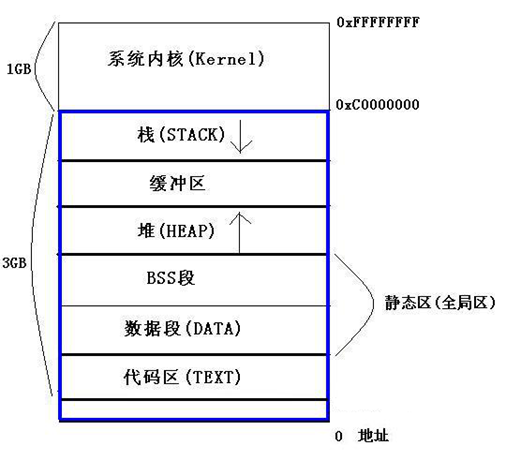
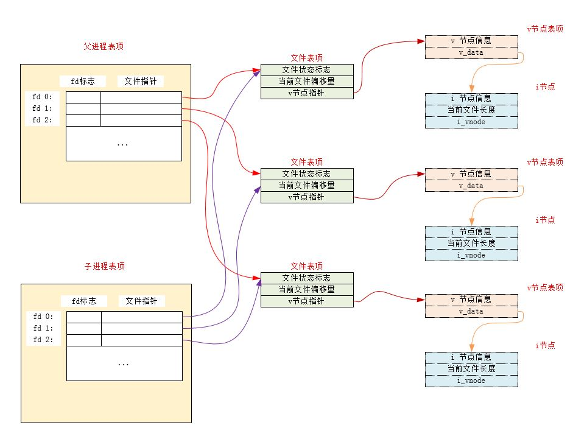
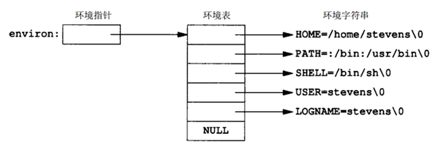
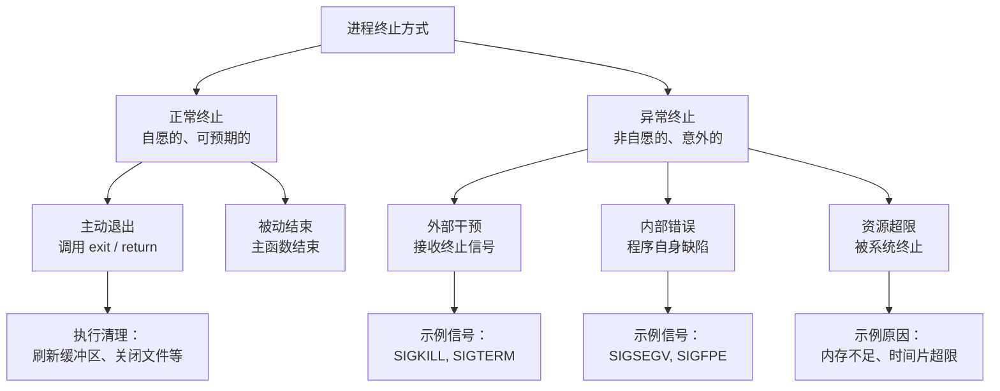
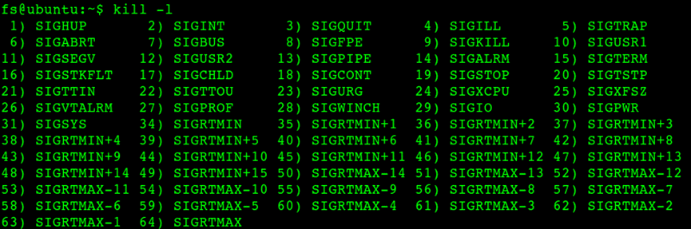

# 进程的概念
## 什么是进程？
进程是正在运行的程序的**实例**，它是操作系统进行**资源分配和调度**的基本单位。
**进程的关键特性：**
- 独立性：每个进程有独立的地址空间
- 并发性：多个进程可以并发执行
- 动态性：进程有创建、运行、挂起、终止等状态变化
- 结构性：由代码段、数据段、堆栈段等组成
# 进程的数据结构
## 进程描述符（task_struct）
Linux内核使用`task_struct`结构体表示进程（include\linux\sched.h）：
```c
// 简化的task_struct结构
struct task_struct {
    volatile long state;          // 进程状态
    pid_t pid;                    // 进程ID
    pid_t tgid;                   // 线程组ID
    struct task_struct *parent;   // 父进程指针
    struct list_head children;    // 子进程链表
    struct list_head sibling;     // 兄弟进程链表
    struct mm_struct *mm;         // 内存管理结构
    struct fs_struct *fs;         // 文件系统信息
    struct files_struct *files;   // 打开的文件
    // ... 其他字段
};
```
## 进程的内存布局(32位)

# 进程的创建与终止
每个进程都有一个非负整数表示的唯一进程 `pid`
- 所谓的唯一，即当前正在系统中运行的所有进程的`ID`各不相同
- 当一个进程`A`终止后，它的进程 `ID` 可以复用
	- 大多数UNIX系统实现的是延迟复用算法，使得新进程`B`的`ID`不同于最近终止的进程`A`的`ID`
- 系统中有一些专用的进程
	- `ID`为0的进程通常是调度进程，也称作交换进程。该进程是操作系统内核的一部分，并不执行任何磁盘上的程序，因此也称作是系统进程
	- `ID`为1的进程通常是`init`进程，在自举过程结束时由内核调用。
		- 该进程对应的程序文件为`/etc/init`，在较新的版本中是`/sbin/init`文件
		- 该进程负责在自举内核后启动一个UNIX系统
		- 该进程通常读取与系统有关的初始化文件（`/etc/rc*`文件，`/etc/inittab`文件以及`/etc/init.d`中的文件），并经系统引导到一个状态
		- 该进程永远不会终止
		- 该进程是一个普通的用户进程（不是内核中的系统进程），但是它以超级用户特权运行
## fork() 系统调用
作用：创建一个新进程
```c
	#include<unistd.h>
	pid_t fork(void);
	pid_t vfork(void);
```
- 返回值：
	- 成功：
		- 子进程返回 0
		- 父进程返回子进程`ID`
	- 失败：返回 -1

注意：
- 如果`fork`调用成功，则它被调用一次，但是返回两次。 两次返回的区别是：子进程的返回值是0，父进程的返回值是新建子进程的进程`ID`
	- 子进程返回值是 0 的理由：一个进程总可以通过`getpid`知道它的进程`ID`，通过`getppid`知道它的父进程的`ID`
	- 父进程返回值是子进程的进程`ID`的理由：一个进程的子进程可以有多个，但是并没有函数可以获取它的子进程的`ID`
- 子进程是父进程的一份一模一样的拷贝，如子进程获取了父进程数据空间、堆、栈的副本。
	- 父子进程共享正文段（因为正文段是只读的）
	- 父子进程并不共享这些数据空间、堆、栈
- 子进程和父进程都从`fork`调用之后的指令开始执行。也就是子进程从出生开始，就跟父进程处于同样的状态
- 由于创建子进程的目的通常是为了完成某个任务，因此`fork`之后经常跟随`exec`，所以很多操作系统的实现并不执行一个父进程数据段、堆和栈的完全拷贝，而是使用写时赋值技术（`copy-on-write:COW`）
	- 这些区域由父进程和子进程共享，而且内核将它们的访问权限改变为只读
	- 如果父子进程中有一个试图修改这些区域，则内核只为修改区域的那块内存制作一个副本
- 通<mark style="background: #FF5582A6;">常`fork`之后，是父进程先执行还是子进程先执行是不确定的</mark>，这取决于内核所使用的进程调度算法
- 注意标准`IO`库的跨`fork`行为。由于标准`IO`库是带缓冲的，因此在`fork`调用之后，这些缓冲的数据也被拷贝到子进程中
- 父进程的所有打开的文件描述符都被复制到子进程中。父进程和子进程每个相同的打开描述符共享同一个文件表项
	- 更重要的是：父进程和子进程共享同一个文件偏移量
	- 如果父进程和子进程写同一个描述符指向的文件，但是又没有任何形式的同步，则它们的输出会相互混合
		- 如果父进程`fork`之后的任务就是等待子进程完成，而不作任何其他的事情，则父进程和子进程无需对打开的文件描述符做任何处理。因为此时只有子进程处理文件
		- 如果父进程`fork`之后，父进程与子进程都有自己的任务要处理，则此时父进程和子进程需要各自关闭它们不需要使用的文件描述符，从而避免干扰对方的文件操作

- 除了打开的文件描述符之外，子进程还继承了父进程的下列属性：实际用户`ID`、实际组`ID`、有效用户`ID`、有效组`ID`、附属组`ID`、进程组`ID`、会话`ID`、控制终端、设置用户`ID`标志和设置组`ID`标志、当前工作目录、根目录、文件模式创建屏蔽字、信号屏蔽和信号处理、对任一打开文件描述符的执行时关闭标志、环境、连接的共享存储段、存储映像、资源限制
- 父进程和子进程的区别为：
	- `fork`返回值不同
	- 进程`ID`不同
	- 进程父进程`ID`不同
	- 子进程的`tms_utime,tms_stime,tms_cutime,tms_ustime`的值设置为0
	- 子进程不继承父进程设置的文件锁
	- 子进程的未处理闹钟被清除
	- 子进程的未处理信号集设置为空集
- `fork`失败的零个主要原因：
	- 系统已经有了太多的进程
	- 实际用户`ID`的进程总数超过了系统的限制（`CHILD_MAX`规定了每个实际用户`ID`在任何时刻拥有的最大进程数）
### fork示例
```c
#include <stdio.h>
#include <unistd.h>
#include <sys/types.h>

int main() {
    pid_t pid;
    
    printf("Before fork, PID=%d, PPID=%d\n", getpid(), getppid());
    
    pid = fork();  // 关键调用！
    
    if (pid < 0) {
        // fork失败
        perror("fork failed");
        return 1;
    } else if (pid == 0) {
        // 子进程代码
        printf("Child: PID=%d, PPID=%d\n", getpid(), getppid());
        // 子进程的fork返回0
    } else {
        // 父进程代码
        printf("Parent: PID=%d, Child PID=%d\n", getpid(), pid);
        // 父进程的fork返回子进程PID
    }
    
    printf("Both processes continue from here\n");
    return 0;
}
```
### vfork() 与 fork() 的区别
| 特性   | fork()        | vfork()        |
| ---- | ------------- | -------------- |
| 地址空间 | 复制整个地址空间（COW） | 共享地址空间         |
| 执行顺序 | 不确定           | 子进程先运行，父进程阻塞   |
| 性能   | 较慢            | 较快             |
| 使用场景 | 通用            | 子进程立即exec()的情况 |
| 安全性  | 安全            | 容易导致问题，已基本废弃   |
```c
#include <stdio.h>
#include <unistd.h>
#include <sys/types.h>

int global_var = 100;

int main() {
    int local_var = 200;
    pid_t pid;
    
    // 使用vfork
    pid = vfork();
    
    if (pid < 0) {
        perror("vfork failed");
        return 1;
    } else if (pid == 0) {
        // 子进程
        global_var++;       // 直接修改父进程变量
        local_var++;        // 直接修改父进程变量
        printf("Child: global=%d, local=%d\n", global_var, local_var);
        _exit(0);          // 必须使用_exit，不能使用exit
    } else {
        // 父进程
        printf("Parent: global=%d, local=%d\n", global_var, local_var);
    }
    
    return 0;
}
```

## exec() 系列函数
当进程调用一种`exec`函数时，该进程执行的程序完全替换成新程序，而新程序则从`main`函数开始执行
- 调用`exec`前后，进程`ID`并未改变。因为`exec`并不创建新进程
- `exec`只是用磁盘上的一个新程序替换了当前进程的正文段、数据段、堆段和栈段

有7种不同的`exec`函数可以供使用，它们被统称称作`exec`函数族：
```c
#include<unistd.h>
int execl(const char *pathname,const char *arg0,.../*(char *) 0 */);
int execv(const char *pathname,char *const argv[]);
int execle(const char *pathname,const char *arg0,.../*(char *) 0
		,char *const envp[] */);
int execve(const char *pathname,char *const argv[],char *const envp[]);
int execlp(const char *filename,const char*arg0,.../*(char *) 0*/);
int execvp(const char *filename, char *const argv[]);
int fexecve(int fd,char *const argv[],char *const evnp[]);
```

|        | 可执行文件查找方式   |             | 向新程序传递参数表的方式 |              | 向新程序传递环境表的方式     |                     |
| ------ | ----------- | ----------- | ------------ | ------------ | ---------------- | ------------------- |
| 函数     | 路径名pathname | 文件名filename | 列表方式list     | 矢量数组方式vector | 继承调用进程的environ变量 | 指定新的环境字符串指针数组envp[] |
| execl  | *****       |             | *****        |              | *****            |                     |
| execlp |             | *****       | *****        |              | *****            |                     |
| execle | *****       |             | *****        |              |                  | *****               |
| execv  | *****       |             |              | *****        | *****            |                     |
| execvp |             | *****       |              | *****        | *****            |                     |
| execve | *****       |             |              | *****        |                  | *****               |
| 字母表示   |             | **p**       | **l**        | **v**        |                  | **e**               |
返回值：
- 若成功：不返回
- 若失败：返回 -1

这几个函数的区别：
- 前四个函数取路径名作为参数；后两个函数取文件名作为参数；最后一个取文件描述符做参数
	- 若`filename`中包含`/`，则视为路径名
	- 若`filename`不包含`/`，则按照`PATH`环境变量指定的各个目录中搜寻可执行文件
- 函数`execl,execlp,execle`要求将新程序的每个命令行参数都说明为一个单独的参数，这种参数表以空指针结尾；函数`execv,execvp,execve,fexecve`应先构造一个指向各参数的指针数组，然后将该指针数组的地址作为参数
	- `l`表示列表`list`
	- `v`表示矢量`vector`
	- `l`形式中，必须以空指针结尾，否则新程序根本不知道要读取多少个参数。空指针就是命令行参数序列终止的标记
	- `v`形式中，数组的最后一个元素必须是空指针，否则报错。
- 以`e`结尾的`execle,execve,fexecve`可以传递一个指向环境字符串指针数组的指针。注意这个数组的最后一个元素必须是空指针，否则报错。其他四个函数则使用调用进程的`environ`变量为新程序复制现有的环境

注意：
- 操作系统对参数表和环境表的总长度有一个限制。在`POSIX`中，这个值至少是 4096 字节
- 执行`exec`之后，新程序的进程ID不变，进程的大多数属性不变。但是对打开文件的处理要注意：
	- 进程中每个打开的文件描述符都有一个执行时关闭标志。若设置了此标志，则执行`exec`时会关闭该文件描述符；否则该文件描述符仍然保持打开。系统默认行为是不设置执行时关闭标志
- 执行`exec`之后，进程的实际用户 ID 和实际组 ID不变，但是进程的有效用户 ID 要注意：
	- 进程的有效用户 ID 和有效组 ID 是否改变取决于所执行程序文件的设置用户 ID 和设置组 ID 位是否设置。
		- 若程序文件的设置用户 ID 位已设置，则进程的有效用户 ID 变成程序文件所有者的 ID；否则有效用户 ID 不变
		- 若程序文件的设置组 ID 位已设置，则进程的有效组 ID 变成程序文件所有组的 ID；否则有效组 ID 不变
- 在很多UNIX操作系统中，这7个函数只有`execve`是内核的系统调用。另外 6 个只是库函数。它们最终都要调用该系统调用

**注意**：
在使用exec函数族时，一定要加上错误判断语句
常见的错误原因有：
- 找不到文件或路径，此时errno被设置为ENOENT
- 数组argv和envp忘记用NULL结束，此时errno被设置为EFAULT
- 没有对应可执行文件的运行权限，此时errno被设置为EACCESS

**环境表**：
每个程序都接收到一张环境表。与参数表一样，环境表也是一个字符指针数组，其中每个  
指针包含一个以NULL结束的字符串的地址。全局变量environ则包含了该指针数组的地址

## 进程终止方式


### 正常终止
**从主函数 `main` 返回**：
- 在C/C++中，当 `main()` 函数执行到 `return` 语句时，进程会终止。返回值（通常0表示成功，非0表示错误）会传递给父进程或操作系统。
**调用 `exit()` 函数**：
- 标准C库函数 `void exit(int status)`。可以在程序的任何地方调用，它会执行一系列“清理工作”，然后终止进程并将状态码返回。
- **清理工作包括**：调用所有由 `atexit()` 或 `on_exit()` 注册的函数、刷新并关闭所有标准I/O流（如 `stdout` 缓冲区里的数据会被写入文件）、删除进程创建的临时文件等。
**调用 `_exit()` 或 `_Exit()` 函数**：
- 这是系统调用 `void _exit(int status)`。它会**立即终止**进程，**不进行任何清理工作**（不清除I/O缓冲区、不调用atexit注册的函数）。
- 通常用于**子进程**。例如，在 fork 创建的子进程中，如果直接调用 `exit()`，可能会错误地刷新父进程的I/O缓冲区，所以常用 `_exit()` 来立即退出。
### 异常终止
**接收导致终止的信号**：
- 这是Linux/Unix系统中异常终止最主要的方式。信号可以由内核、其他进程或用户（如在终端按 `Ctrl+C`）发送。
- **常见终止信号**：
    - **`SIGINT`**：**中断信号**。用户按 `Ctrl+C` 时产生。通常导致进程终止，但进程可以捕获并忽略它。
    - **`SIGKILL`**：**必杀信号**。编号为 `9`。`kill -9 PID` 命令发送此信号。**进程无法捕获、阻塞或忽略**该信号，是强制终止进程的最终手段。
    - **`SIGTERM`**：**终止信号**。`kill PID` 默认发送的信号。这是一个友好的终止请求，进程可以捕获它并进行优雅的清理后退出。
    - **`SIGSEGV`**：**段错误信号**。当进程进行非法内存访问（如访问空指针、数组越界）时，由操作系统发送。
    - **`SIGFPE`**：**算术异常信号**。如除零错误、浮点溢出。
    - **`SIGABRT`**：**中止信号**。通常由 `abort()` 函数产生，引发核心转储。
**进程自身调用 `abort()` 函数**：
- 该函数会产生 `SIGABRT` 信号，默认行为是终止进程并可能产生核心转储文件（用于调试）。它也是一种异常终止。
**最后一个线程被取消或退出**：
- 在多线程程序中，如果主线程先于其他线程退出，整个进程通常不会终止。但当进程中的所有线程都终止时，进程才会终止。如果某个线程执行了非法操作导致“线程异常”，也可能最终导致整个进程被终止。
**被操作系统强制终止**：
- 当进程违反了系统规则时，操作系统内核会将其终止。例如：
    - **资源超限**：使用的CPU时间、内存等超过了系统限制。
    - **响应 `Ctrl+\\`**：用户按 `Ctrl+\` 会发送 `SIGQUIT` 信号，通常会导致进程终止并生成核心转储。

### `exit/_Exit/_exit`函数
作用：终止一个进程
```c
#include<stdlib.h>
void exit(int status);
void _Exit(int status);
#include<unistd.h>
void _exit(int status);
```
- 参数：`status`：终止状态
上述三个退出函数的区别：
- `_exit`和`_Exit`函数：立即进入内核
- `exit`函数：先执行一些清理处理，然后返回内核
- `exit`和`_Exit`是由`ISOC`说明的， `_exit`是由`POSIX`说明的 ，因此头文件不同
注意：
- 上述三个函数都带有一个整型参数，称为终止状态（或称作退出状态）。大多数 UNIX 系统 shell 都提供检查进程终止状态的方法
    - 若调用上述三个函数时不带终止状态，则该进程的终止状态是未定义的
    - 若`main`执行了一个无返回值的`return`语句，则该进程的终止状态是未定义的
    - 若`main`没有声明返回类型为整型，则该进程的终止状态是未定义的
    - 若`main`声明返回类型为整型，并且`main`执行到最后一条语句时返回（隐式返回），则该进程的终止状态是 0
- `main`函数返回一个整型值与用该值调用`exit`是等价的。即`main`函数中，`exit(100);`等价于`return 100;`
- 在LINUX中，退出状态码最高是255，一般自定义的代码值为0~255，如果超出255，则返回该数值被256除了之后的余数
#### `exit与_exit`的区别
#### `exit`函数
`exit()`是标准C库函数，声明在`stdlib.h`中。它执行以下操作：
- 调用通过`atexit()`和`on_exit()`注册的退出处理函数（按注册的相反顺序执行）。
- 刷新所有打开的标准I/O流（即写入缓冲区中的数据）。
- 关闭所有打开的标准I/O流。（但不会关闭原始文件描述符）
- 然后，调用`_exit()`系统调用来终止进程。
```c
#include <stdio.h>
#include <stdlib.h>
#include <unistd.h>
#include <signal.h>

// 资源管理结构
typedef struct {
    FILE *log_file;
    void *buffer;
    int db_connection;
} AppContext;

// 全局上下文
AppContext *app_ctx = NULL;

void cleanup_resources() {
    printf("执行资源清理...\n");
    
    if (app_ctx) {
        if (app_ctx->log_file) {
            printf("关闭日志文件\n");
            fclose(app_ctx->log_file);
        }
        
        if (app_ctx->buffer) {
            printf("释放内存缓冲区\n");
            free(app_ctx->buffer);
        }
        
        printf("关闭数据库连接\n");
        // 这里假设有数据库关闭操作
        
        free(app_ctx);
        app_ctx = NULL;
    }
}

void signal_handler(int sig) {
    printf("\n接收到信号 %d，优雅退出\n", sig);
    exit(1);  // 会调用atexit注册的清理函数
}

void normal_application() {
    printf("=== 正常应用程序示例 ===\n");
    
    // 初始化资源
    app_ctx = malloc(sizeof(AppContext));
    app_ctx->log_file = fopen("app.log", "w");
    app_ctx->buffer = malloc(1024);
    app_ctx->db_connection = 1;  // 假设已连接
    
    // 注册清理函数
    atexit(cleanup_resources);
    
    // 设置信号处理
    signal(SIGINT, signal_handler);
    signal(SIGTERM, signal_handler);
    
    printf("应用程序运行中...\n");
    printf("按Ctrl+C退出\n");
    
    // 模拟工作
    for (int i = 0; i < 5; i++) {
        printf("工作循环 %d\n", i);
        sleep(1);
        
        // 写入日志
        if (app_ctx->log_file) {
            fprintf(app_ctx->log_file, "Log entry %d\n", i);
        }
    }
    
    printf("正常完成工作\n");
    // exit(0)会被隐式调用
}
```
#### `_exit`函数
`_exit()`是系统调用，声明在`unistd.h`中。它直接终止进程，不会执行以下操作：
- 不会调用通过`atexit()`或`on_exit()`注册的退出处理函数。
- 不会刷新标准I/O缓冲区（也就是说，缓冲区中的数据可能会丢失）。
- 立即终止进程。
```c
#include <stdio.h>
#include <stdlib.h>
#include <unistd.h>
#include <sys/wait.h>

void child_process_example() {
    printf("=== 子进程中使用_exit()的示例 ===\n");
    
    pid_t pid = fork();
    
    if (pid < 0) {
        perror("fork failed");
        exit(1);
    }
    
    if (pid == 0) {
        // 子进程
        printf("子进程开始执行\n");
        
        // 情况1：子进程立即exec另一个程序
        // 在exec之前，应该使用_exit()而不是exit()
        // 因为exit()会刷新父进程的缓冲区
        
        // 情况2：子进程发生致命错误
        printf("子进程尝试打开不存在的文件\n");
        FILE *f = fopen("/nonexistent/file", "r");
        if (!f) {
            fprintf(stderr, "文件打开失败\n");
            
            // 使用_exit()避免刷新父进程的缓冲区
            // 同时确保不会调用父进程注册的atexit处理函数
            _exit(127);  // 约定：127表示命令未找到
        }
        
        // 正常情况应该不会执行到这里
        fclose(f);
        _exit(0);
    } else {
        // 父进程
        int status;
        waitpid(pid, &status, 0);
        
        if (WIFEXITED(status)) {
            printf("子进程退出状态: %d\n", WEXITSTATUS(status));
        }
    }
}

void double_fork_daemon() {
    printf("\n=== 双重fork创建守护进程示例 ===\n");
    
    pid_t pid = fork();
    
    if (pid < 0) {
        perror("第一次fork失败");
        exit(1);
    }
    
    if (pid > 0) {
        // 父进程退出
        exit(0);
    }
    
    // 第一个子进程继续
    setsid();  // 创建新会话
    
    pid = fork();  // 第二次fork
    if (pid < 0) {
        perror("第二次fork失败");
        _exit(1);  // 使用_exit()避免刷新缓冲区
    }
    
    if (pid > 0) {
        // 第二个父进程（即第一个子进程）退出
        _exit(0);  // 重要：使用_exit()而不是exit()
    }
    
    // 现在我们是守护进程（第二个子进程）
    printf("守护进程PID: %d\n", getpid());
    
    // 守护进程工作
    for (int i = 0; i < 3; i++) {
        printf("守护进程运行中...\n");
        sleep(1);
    }
    
    _exit(0);
}
```

#### 使用决策
| 决策因素            | 选择exit() | 选择_exit() |
| --------------- | -------- | --------- |
| **需要清理资源**      | ✓        | ✗         |
| **fork()后的子进程** | ✗        | ✓         |
| **exec()之前**    | ✗        | ✓         |
| **守护进程创建**      | ✗        | ✓         |
| **信号处理函数中**     | ✗（不安全）   | ✓         |
| **多线程程序**       | 主线程可以    | 子线程不用     |
| **需要确保输出**      | ✓（刷新缓冲区） | ✗（可能丢失）   |
| **性能考虑**        | 较慢（有清理）  | 快速（直接退出）  |
**黄金法则**：
- 在主程序中使用`exit()`进行优雅退出    
- 在fork()后的子进程中，如果不需要清理父进程的资源，使用`_exit()`
- 在exec()失败时，总是使用`_exit()`
- 在信号处理函数中，考虑使用`_exit()`以确保安全
#### 与return的区别
return：
- return 是C语言的关键字，用于从函数中返回。
- 如果return在main函数中使用，那么程序会终止，并将返回值作为进程的退出状态。
- 如果return在其他函数中使用，那么只是从当前函数返回到调用函数，并不会终止进程。
当在main函数中使用return时，实际上会调用exit()函数。也就是说，main函数中的return语句会隐含调用exit()

 `exit()`和`_exit()` 函数
- 这两个函数都是用于终止进程的，不管在程序的什么位置调用，都会导致进程终止。
- exit()是标准C库函数，它会执行一些清理工作（如刷新缓冲区、调用atexit注册的函数等）然后终止进程。
- exit()是系统调用，它直接终止进程，不会进行清理工作。
### system函数
作用：在程序中执行一个命令字符串
```c
	#include<stdlib.h>
	int system(const char *cmdstring);
```
- 参数：
	- `cmdstring`：命令字符串（在`shell`中执行），如 `"ps -aux"`
- 返回值：
	- 有三种返回值。见下面描述

`system`用于将一个字符作为命令来执行。它等同于同时调用了`fork、exec、waitpid`。有三种返回值：
- `fork`失败或者`waitpid`返回除了`EINTR`之外的错误，则`system`返回 -1，并且设置`errno`以指示错误类型
- 如果`exec`失败(表示不能执行`shell`)，则其返回值如同`shell`执行了`exit(127)`一样
- 如果三个函数都执行成功，则`system`返回值是`shell`的终止状态，其格式在`waitpid`中说明

`system`对操作系统依赖性很强。目前在`UNIX`操作系统上，`system`总是可用的。如果`cmdstring`为空指针，则如果`system`返回 0 表示该操作系统不支持`system`函数；否则支持。

`system`相较于`fork+exec`的优点是：`system`进行了所需的各种出错处理以及各种信号处理。缺点是：一旦调用`system`的进程具有超级用户权限，则`system`执行的命令也具有超级用户权限。
> 因为`system`的实现过程中并没有更改有效用户ID和实际用户ID的操作。

>- 因此如果一个进程以特殊的权限运行，而它又想生成另一个进程执行另外一个程序，则它应该直接使用`fork_exec`并且在`fork`之后，`exec`之前改回普通权限。
>- 设置用户`ID`和设置组`ID`程序绝不应该调用`system`函数

### 注册程序退出时调用的函数
在C语言中，`atexit`和`on_exit`都是用于注册程序退出时调用的函数，但它们在标准、可移植性和功能上有所不同。
```c
#include <stdlib.h>
int atexit(void (*function)(void));

#include <stdlib.h>
int on_exit(void (*function)(int, void *), void *arg);
```
注意：
`on_exit`不是标准C函数，而是源自BSD，<mark style="background: #FFB8EBA6;">因此可移植性较差</mark>。它被定义在`<stdlib.h>`中，但并不是所有的平台都支持（例如，Windows通常不支持）。而`atexit`是标准C函数，可移植性好。
#### `atexit`函数
- 注册的函数必须是无参无返回值的函数，即 `void (*)(void)`
- 可以注册多个函数，它们将在程序正常退出（通过`exit`或从`main`返回）时被调用，调用顺序与注册顺序相反（后注册的先调用）
- 如果同一个`exit handler`被登记多次，则它也会被调用多次
- 无法获取退出状态码
```c
#include <stdio.h>
#include <stdlib.h>

void cleanup1(void) {
    printf("cleanup1 called\n");
}

void cleanup2(void) {
    printf("cleanup2 called\n");
}

int main(void) {
    atexit(cleanup1);
    atexit(cleanup2);
    
    printf("main is done, exiting...\n");
    return 0;
}
```
输出：
```c
main is done, exiting...
cleanup2 called
cleanup1 called
```
#### `on_exit`函数
- 注册的函数原型为 `void (*)(int, void *)`，第一个参数是退出状态码（即传递给`exit`的值或从`main`返回的值），第二个参数是注册时传递的`arg`指针
- 同样可以注册多个函数，调用顺序也是后注册的先调用
- 由于可以获取退出状态码，因此可以根据不同的退出状态执行不同的清理操作
```c
#include <stdio.h>
#include <stdlib.h>

void my_exit(int status, void *arg) {
    printf("Exit with status %d, arg = %s\n", status, (char*)arg);
}

int main(void) {
    char *arg = "my_argument";
    on_exit(my_exit, arg);
    
    printf("main is done, exiting...\n");
    return 42;
}
```
输出：
```c
main is done, exiting...
Exit with status 42, arg = my_argument
```
## 回收子进程状态
内核为每个终止子进程保存了一定量的信息，所以当终止进程的父进程调用`wait`函数或者`waitpid`函数时，可以得到这些信息。
- 这些信息至少包括：终止进程的进程`ID`、终止进程的终止状态、终止进程的使用的CPU时间总量
- 内核此时可以释放终止进程使用的所有内存，关闭它所有的打开文件。但是该终止进程还残留了上述信息等待父进程处理		
- 我们称一个已经终止、但是等待父进程对它进行善后处理的进程称作僵死进程，在`ps`命令中显示为`Z`
	- 所谓善后处理，就是父进程调用`wait`函数或者`waitpid`函数读取终止进程的残留信息
	- 一旦父进程进行了善后处理，则终止进程的所有占用资源（包括残留信息）都得到释放，该进程被彻底销毁
- 对于`init`超级进程，它被设计成：任何时候只要有一个子进程终止，就立即调用`wait`函数取得其终止状态。这种做法防止系统中塞满了僵死进程

当一个进程终止时，内核就向其父进程发送`SIGCHLD`信号。这种信号是一个异步信号，因为该信号可能在任何时间发出
- 父进程可以选择忽略此信号。这是系统的默认行为
- 父进程也可以针对此信号注册一个信号处理程序，从而当接收到该信号时调用相应的信号处理程序

### `wait/waitpid`函数：
作用：回收子进程状态
```c
    #include <sys/types.h>
    #include <sys/wait.h>
	pid_t wait(int *staloc);
	pid_t waitpid(pid_t pid,int *staloc,int options);
```
- 参数：
	- `staloc`：存放子进程终止状态的缓冲区的地址。如果你不关心子进程的终止状态，则可以设它为空指针`NULL`
	
	对于`waitpid`函数：
	- `pid`：
		- 如果`pid==-1`：则等待任意一个子进程终止
		- 如果`pid>0`：则等待进程`ID`等于`pid`的那个子进程终止
		- 如果`pid==0`：则等待组`ID`等于调用进程组`ID`的任一子进程终止			
		- 如果`pid<0`：等待组`ID`等于`pid`绝对值的任一子进程终止
	- `options`：或者是0，或者是下列常量按位或的结果：
		- 0:同wait,阻塞父进程，等待子进程退出。
		- `WNOHANG`：没有指定的子进程终止时，并不阻塞程序的执行
		- `WUNTRACED`：执行作业控制。若操作系统支持作业控制，则由`pid`指定的任一子进程在停止后已经继续，但其状态尚未报告，则返回其状态
		- `WCONTINUED`：执行作业控制。若操作系统支持作业控制，则由`pid`指定的任一子进程已处于停止状态，并且其状态自停止以来尚未报告过，则返回其状态 
		- 进程的停止状态：类似于暂停。它不同于终止状态
- 返回值：
	- 成功：返回终止子进程的进程`ID`
	- 失败：返回 0 或者 -1
注意：
- `wait`的语义是等待任何一个子进程终止：
	- 如果当前进程的所有子进程都还在运行，则阻塞
	- 如果有一个子进程已终止，正在等待父进程获取其终止状态，则当前进程取得该子进程的终止状态并立即返回
	- 如果当前进程没有任何子进程，则立即出错返回

- `waitpid`的语义是等待指定的子进程终止：
	- 如果当前进程的所有子进程都在运行：
		- 如果`options`指定为`WNOHANG`，则`waitpid`并不阻塞，而是立即返回 0
		- 如果`options`未指定为`WNOHANG`，则`waitpid`阻塞
	- 如果指定`pid`的子进程已终止，正在等待父进程获取其终止状态，则当前进程取得该子进程的终止状态并立即返回
	- 如果指定的`pid`有问题（如不存在，或者不是当前进程的子进程），则立即出错返回

- 对于出错的情况：
	- `wait`出错的原因是：
		- 调用进程没有子进程
		- 函数调用（正在阻塞中）被一个信号中断
	- `waitpid`出错的原因是：
		- 指定的进程或者进程组不存在
		- `pid`指定的进程不是调用进程的子进程
		- 函数调用（正在阻塞中）被一个信号中断
- 可以通过宏从终止状态中取得退出状态以及终止原因等：
	- `WIFEXITED(status)`：如果子进程正常终止，则为真。此时可以执行`WEXITSTATUS(status)`获取子进程的退出状态的低 8 位
	- `WIFSIGNALED(status)`：如果子进程异常终止，则为真。此时可以执行`WTERMSIG(status)`获取使得子进程终止的信号编号
	- `WIFSTOPPED(status)`：如果子进程的当前状态为暂停，则为真。此时可执行`WSTOPSIG(status)`获取使得子进程暂停的信号编号
	- `WIFCONTINUED(status)`:如果子进程在暂停后已经继续执行了，则为真。
---
示例：
```c
#include <stdio.h>
#include <stdlib.h>
#include <unistd.h>
#include <sys/wait.h>
#include <sys/types.h>
#include <errno.h>

void waitpid_example() {
    printf("=== waitpid() 示例 ===\n");
    
    // 创建3个子进程
    pid_t pids[3];
    
    for (int i = 0; i < 3; i++) {
        pids[i] = fork();
        
        if (pids[i] < 0) {
            perror("fork failed");
            exit(1);
        } else if (pids[i] == 0) {
            // 子进程
            printf("子进程 %d (序号 %d) 启动\n", getpid(), i+1);
            sleep((i+1) * 2);  // 每个子进程睡眠不同时间
            printf("子进程 %d 结束\n", getpid());
            exit(i+10);  // 不同的退出状态
        }
    }
    
    // 父进程
    printf("父进程 %d 创建了 %d 个子进程\n", getpid(), 3);
    
    // 等待所有子进程
    int still_waiting = 3;
    
    while (still_waiting > 0) {
        int status;
        
        // 非阻塞方式等待
        pid_t terminated_pid = waitpid(-1, &status, WNOHANG);
        
        if (terminated_pid == 0) {
            // 没有子进程结束，做其他工作
            printf("父进程工作中...\n");
            sleep(1);
        } else if (terminated_pid > 0) {
            // 有子进程结束
            printf("子进程 %d 结束\n", terminated_pid);
            
            if (WIFEXITED(status)) {
                printf("  退出状态: %d\n", WEXITSTATUS(status));
            }
            
            still_waiting--;
        } else if (terminated_pid == -1) {
            if (errno == ECHILD) {
                printf("没有更多子进程\n");
                break;
            } else {
                perror("waitpid failed");
                break;
            }
        }
    }
    
    printf("所有子进程都已结束\n");
}

void waitpid_specific_child() {
    printf("\n=== 等待特定子进程 ===\n");
    
    pid_t child1 = fork();
    
    if (child1 == 0) {
        // 子进程1
        printf("子进程1 (PID: %d) 启动\n", getpid());
        sleep(3);
        printf("子进程1 结束\n");
        exit(1);
    }
    
    pid_t child2 = fork();
    
    if (child2 == 0) {
        // 子进程2
        printf("子进程2 (PID: %d) 启动\n", getpid());
        sleep(1);
        printf("子进程2 结束\n");
        exit(2);
    }
    
    // 父进程：只等待child1，不等待child2
    printf("父进程等待特定子进程 %d\n", child1);
    
    int status;
    pid_t result = waitpid(child1, &status, 0);
    
    if (result == child1) {
        printf("特定子进程 %d 已结束\n", child1);
    }
    
    // child2会成为僵尸进程，因为父进程没有等待它
    printf("子进程2 (PID: %d) 将成为僵尸进程\n", child2);
    sleep(5);  // 给时间观察
    
    // 最后再等待child2
    waitpid(child2, &status, 0);
    printf("清理子进程2\n");
}

int main() {
    waitpid_example();
    waitpid_specific_child();
    return 0;
}
```
### `waitid`函数
作用：用于等待子进程状态变化的系统调用，它提供了比 `waitpid` 更多且更灵活的功能
```c
#include <sys/wait.h>

int waitid(idtype_t idtype, id_t id, siginfo_t *infop, int options);
```
- 参数：
	- `idtype`：指定了`id`类型，可以为下列常量
		- `P_PID`：等待特定进程。此时`id`表示要等待的子进程的进程`ID`
		- `P_GID`：等待属于特定进程组的任一子进程。此时`id`表示要等待的进程组`ID`
		- `P_ALL`：等待任一子进程。此时忽略`id`
		- `P_PIDFD`（Linux 5.4+）：等待由进程文件描述符（pidfd）指定的子进程，此时 `id` 为进程文件描述符。
	- `id`：指定的进程`id`或者进程组`id`
	- `infop`：一个缓冲区的地址。该缓冲区由`waitid`填写，存放了造成子进程状态改变的有关信号的详细信息
	- `options`：指示调用者关心哪些状态变化。可以是下列常量的按位或：
		- `WCONTINUED`：等待因收到 `SIGCONT` 而恢复执行的进程。
		- `WEXITED`：等待已经终止的子进程
		- `WNOHANG`：如无可用的子进程终止状态，立即返回而不是阻塞
		- `WNOWAIT`：在返回后，子进程仍处于可等待状态（即子进程的退出状态不会被消耗，后续还可以再次等待）
		- `WSTOPPED`：等待这样的子进程：它已经停止，但是其状态尚未报告
- 返回值：
	- 成功： 返回 0
	- 失败： 返回 -1 

与 `waitpid` 的区别：
1. **更灵活的等待条件**：`waitid` 允许通过 `idtype` 指定等待进程组中的所有进程，而 `waitpid` 只能等待单个进程或任意进程。
2. **更详细的返回信息**：`waitid` 通过 `siginfo_t` 结构返回更丰富的信息，包括进程ID、用户ID、退出状态、信号等。
3. **更多选项**：`waitid` 提供了 `WEXITED`、`WSTOPPED`、`WCONTINUED` 来精确指定要等待的事件类型，而 `waitpid` 通过 `options` 参数提供类似功能，但 `waitid` 更加明确。
4. **保留状态**：`waitid` 的 `WNOWAIT` 选项允许在获取子进程状态后，子进程的状态保持不变，以便后续再次等待。
```c
#include <stdio.h>
#include <stdlib.h>
#include <unistd.h>
#include <sys/wait.h>
#include <sys/types.h>

int main() {
    pid_t pid = fork();

    if (pid < 0) {
        perror("fork failed");
        exit(EXIT_FAILURE);
    } else if (pid == 0) {
        // 子进程
        printf("Child process (PID=%d) is running.\n", getpid());
        sleep(2);  // 模拟子进程工作
        exit(42);   // 子进程退出状态为42
    } else {
        // 父进程
        siginfo_t infop;
        int options = WEXITED;  // 等待子进程退出

        printf("Parent process (PID=%d) is waiting for child (PID=%d).\n", getpid(), pid);

        // 使用 waitid 等待子进程退出
        if (waitid(P_PID, pid, &infop, options) == -1) {
            perror("waitid failed");
            exit(EXIT_FAILURE);
        }

        // 检查是否成功等待到子进程
        if (infop.si_pid == pid) {
            printf("Child process (PID=%d) has exited.\n", infop.si_pid);
            if (infop.si_code == CLD_EXITED) {
                printf("Child exited normally with status: %d\n", infop.si_status);
            } else if (infop.si_code == CLD_KILLED) {
                printf("Child was killed by signal: %d\n", infop.si_status);
            }
        } else {
            printf("Unexpected child process (PID=%d) exited.\n", infop.si_pid);
        }
    }

    return 0;
}
```

# 进程管理
## shell下的进程管理
### **启动进程**
#### at命令
在指定的时刻执行相关的进程

首先检查atd服务有无开启
`ps -eLf | grep atd`查看， 
如果没有开启则需要开启用`/etc/init.d/atd start or restart`
语法：` at [参数] [时间]`
- 命令参数
	- -m 当指定的任务被完成之后，将给用户发送邮件，即使没有标准输出
	- -I atq的别名
	- -d atrm的别名
	- -v 显示任务将被执行的时间
	- -c 打印任务的内容到标准输出
	- -V 显示版本信息
	- -q<列队> 使用指定的列队
	- -f<文件> 从指定文件读入任务而不是从标准输入读入
- 时间格式
- HH:MM YYYY-MM-DD
	说明：规定在某年某月的某一天的特殊时刻进行该项任务
```bash
	at 04:00 2009-03-17
```
- HH:MM[am|pm] + number [minutes|hours|days|weeks]
	说明：规定在某个时间点再加多少时间后才进行该项任务  
```bash
	at now + 5 minutes  
	at 04:00pm + 3 days
	-t<时间参数> 以时间参数的形式提交要运行的任务
	at> 执行的指令
	退出at命令 ctrl+d
```
- 能够直接使用today（今天）、tomorrow（明天）来指定完成命令的时间
```bash
	at 11:30am today
	at>ls > ~/t.log
	at> <EOT> //按Ctl-D退出
```
查询当前的等待任务，被执行之后就不会显示 
```bash
atq
```
删除系统中由at建立的正在等待被执行的任务
```bash
# atrm 任务的工作号  
例如：# atrm 17
```

### 进程调度
#### nice 和 renice
nice是按照指定的优先级执行命令
renice更改正在运行的进程的优先级
系统中运行的每个进程都有一个优先级(亦称“nice 值”)，其范围从 -20 (最高优先级)到 19 (最低优先级)。优先级越高，其值越小。默认情况下，进程的优先级是 0 (“基本”调度优先级)。优先级比较大的进程(nice 值比较小，最低到 -20)相对优先级比较小的进程(直到 19)将比较频繁地被调度运行，因此就拥有更多的进程周期。一般用户只能降低它们自己进程的优先级别，并限于 0 到 19 之间。超级用户(root)可以将任何进程的优先级设定为任何值。
可以通过ps -elf 或者是top 来查看这个

其中<mark style="background: #FF5582A6;">NI</mark>指的就是优先级。
- nice用法：
`nice -n 优先级 command`
```bash
# 例如
nice -n 6 ./a.out # 以优先级6来运行a.out
```

- renice用法:
`renice 优先级 pid`
```bash
# 例如
renice +10 9621 # 将9621进程的优先级改为10
```
注意：优先级的值不能小于0，除非具有超级用户权限。
### 结束进程
注意`kill`的作用不仅仅是杀死一个进程。而是向一个进程发送信号。可以通过`kill -l`查看`kill`所支持发送的信号。

我们可以通过`kill -signalnum pid`的方式向进程发送信号。
```bash
# 例如
kill -19 4682 # 向pid=4682的进程发送SIGSTOP信号暂停进程。
```
<mark style="background: #FF5582A6;">如果不选择信号的类型默认情况下发送的是SIGTERM信号。</mark>
## 程序中的进程管理
### 进程调度
#### `nice`函数
作用：进程通过它来获取自己的`nice`值或者修改自己的`nice`值
```c
	#include<unistd.h>
	int nice(int incr);
```
- 参数：
	- `incr`：`nice`值的增量
- 返回值：
	- 成功：返回新的`nice`值
	- 失败：返回 -1

`incr`会被增加到调用进程的`nice`值上。
- 如果`incr`值太大，系统会直接将它降到最大合法值，不会出错（`UBUNTU 16.04`中是 19）
- 如果`incr`值太小，系统会直接将它提高到最小合法值，不会出错（`UBUNTU 16.04`中是 -20）
	- 由于 -1 是合法的成功返回值。因此在`nice`返回 -1 时，需要综合`errno`才能判断是否出错
#### `getpriority/setpriority`函数
作用：获取/设置进程的`nice`值
```c
	#include<sys/resource.h>
	int getpriority(int which,id_t who);
	int setpriority(int which,id_t who,int value);
```
- 参数：
	- `which`：控制`who`参数是如何解释的。可以取三个值之一：
		- `PRIO_PROCESS`：表示进程
		- `PRIO_PGRP`:表示进程组
		- `PRIO_USER`表示用户`ID`
	- `who`：选择感兴趣的一个或者多个进程。
		- 如果`who`为0，`which`为`PRIO_PROCESS`，返回当前进程的`nice`值
		- 如果`who`为0，`which`为`PRIO_PGRP`，则返回进程组中最小的`nice`值
		- 如果`who`为0，`which`为`PRIO_USER`，则返回调用进程的实际用户`ID`拥有的那些进程中最小的`nice`值
	- `value`：`nice`的增量

- 返回值：
	- `getpriority`：成功返回`-20～19`之间的`nice`值；失败返回  -1

`getpriority`不仅可以获得本进程的`nice`值，还可以获取一组相关进程的`nice`值。而`setpriority`可以为本进程、进程组、属于特定用户`ID`的所有进程设置优先级